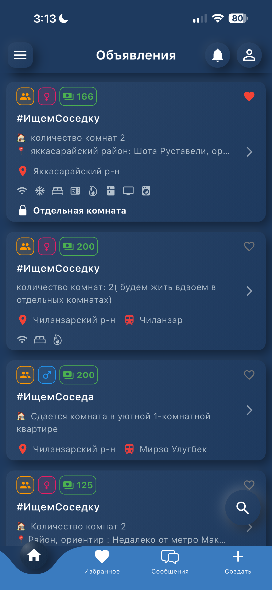
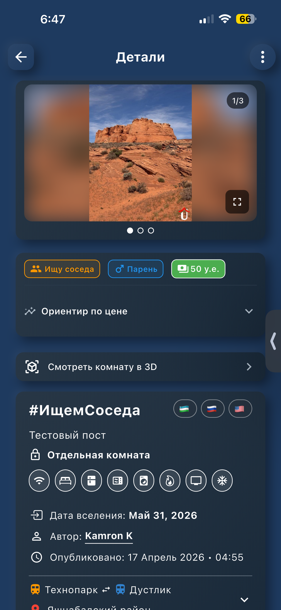
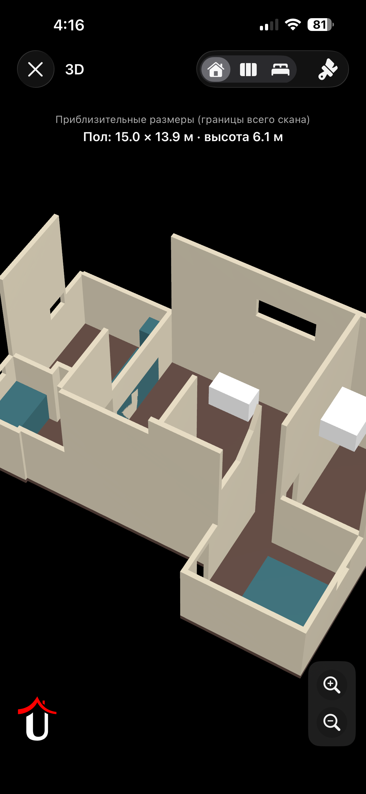
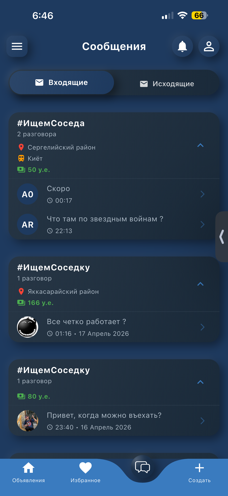
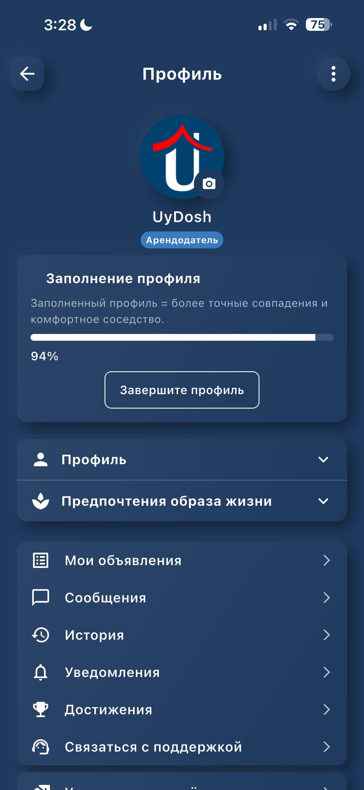
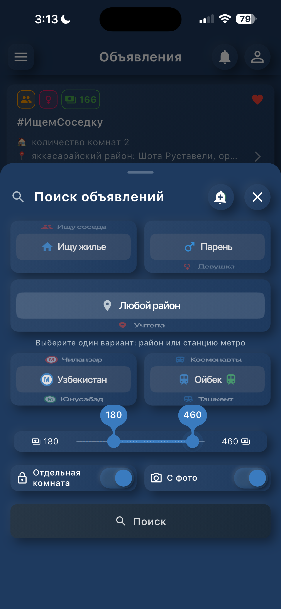
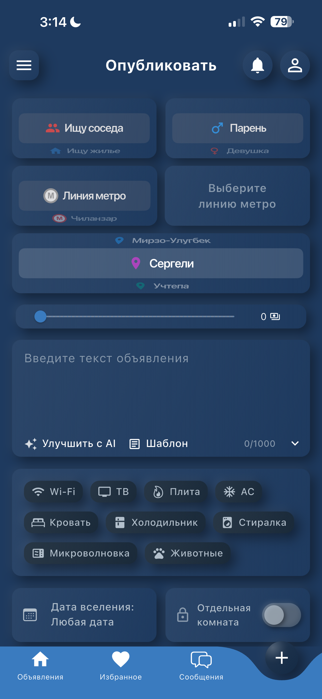

<p align="center">
  
</p>

# UyDosh — Find a Room, a Roommate, or the Right Space in Uzbekistan

UyDosh is a mobile-first marketplace that helps people in Uzbekistan find rooms,
apartments and roommates. It combines classic search-and-browse with modern
features that matter on the ground here: metro-station-aware filtering,
in-app messaging, AI-assisted listing writing, and — on LiDAR-capable iPhones
and iPads — a full 3D scan of the room so viewers can walk around the space
before ever meeting.

The project is a Flutter application built with a clean, layered architecture,
BLoC + `ChangeNotifier` state, `GetIt` service locator, `Dio` networking, and
Firebase for auth, messaging, analytics and crash reporting.

<p align="center">
  <a href="https://flutter.dev"></a>
  <a href="https://dart.dev"></a>
  
  
  
  
</p>

<p align="center">
  
  
  
  
  
</p>

---

## Table of Contents

- [Highlights](#highlights)
- [Feature Tour](#feature-tour)
  - [Search & Discovery](#search--discovery)
  - [Listings & Photos](#listings--photos)
  - [3D LiDAR Room Scan (iOS)](#3d-lidar-room-scan-ios)
  - [AI-Assisted Writing (Gemini)](#ai-assisted-writing-gemini)
  - [Authentication & Profile](#authentication--profile)
  - [Messaging](#messaging)
  - [Favorites, History & Saved Searches](#favorites-history--saved-searches)
  - [Gamification & Achievements](#gamification--achievements)
  - [Support, Complaints & Moderation](#support-complaints--moderation)
  - [Notifications & Deep Links](#notifications--deep-links)
  - [Admin Panel](#admin-panel)
  - [Maps & Location](#maps--location)
  - [Localization, Theming & Accessibility](#localization-theming--accessibility)
- [Architecture](#architecture)
- [Project Structure](#project-structure)
- [Tech Stack](#tech-stack)
- [Getting Started](#getting-started)
- [Configuration](#configuration)
- [Build & Release](#build--release)
- [Testing](#testing)
- [Further Reading](#further-reading)
- [Contributing](#contributing)
- [License](#license)

---

## Highlights

- **Room + roommate marketplace** with price range, gender preference,
  private-room toggle, move-in date, amenities, region/district, and metro
  line/station filters.
- **3D room walk-through** powered by iOS ARKit + RoomPlan. Scans are exported
  to `USDZ`, uploaded to the listing, and displayed in a custom SceneKit viewer
  with a *Hide walls / Floor only* mode for instant spatial understanding.
- **AI description helpers** (Google Gemini, proxied through the backend with a
  direct-SDK fallback): one-tap translation between Uzbek, Russian and English,
  and an *Enhance* action that fixes grammar without changing the language.
- **Phone + Google Sign-In** via Firebase Auth, with Firebase App Check
  protecting the API.
- **Real-time messaging**, unread-badge syncing to the OS app icon, push
  notifications (FCM), and deep links (`app_links`).
- **Gamification**: achievements, streaks and unlock animations with confetti
  and fireworks.
- **Full admin console** embedded in the same binary (hidden behind role):
  users, listings, complaints, heatmaps, moderation, Telegram sync,
  area-price cache, search analytics.
- **Tri-lingual** (Uzbek, Russian, English) with an in-app language switcher
  and per-locale date pickers.
- **Theming**: light and blue themes with a sun/moon toggle and a 3D-neumorphic
  design system applied consistently across buttons, cards and app-bar icons.

---

## Feature Tour

### Search & Discovery

<p align="center">
  
  &nbsp;&nbsp;
  
</p>

- Infinite-scroll listings feed with pull-to-refresh (`uydosh_refresh_indicator`).
- Rich filter sheet: listing type (room available / roommate needed),
  location (region + district), metro line and station, price range, gender,
  private-room toggle, and move-in date.
- **Transfer-station aware**: when a station is a transfer between multiple
  metro lines, nearby results from the sibling lines are automatically
  included.
- **Saved search alerts**: persist any filter combination; the app bar bell
  turns on and pulses when there are new matches, and an in-app tutorial
  highlights the feature the first time it becomes available.
- Dedicated **view history** screen lists everything you've recently tapped on.

### Listings & Photos

<p align="center">
  
  &nbsp;&nbsp;
  
</p>

- Grid/list with animated "featured" border for boosted listings.
- Detail screen blocks: photos carousel, meta badges, description
  (with on-demand translation), amenities, compatibility card, metro +
  district map section, area price statistics, and complaints card.
- **Custom full-screen camera** (`camera` + a hand-built review step) for
  in-app photo capture with flash control, device-orientation-aware capture,
  and optional watermarking (`watermark_service`).
- **Image cropping** (`image_cropper`), primary-photo selection, reordering
  and per-photo deletion.
- Owner tools on own listings: edit, toggle active, feature, upload a 3D
  scan, view stats.

### 3D LiDAR Room Scan (iOS)

<p align="center">
  
</p>

On LiDAR-equipped iPhones and iPads (iPhone 12 Pro and later, iPad Pro M-series),
UyDosh uses Apple's RoomPlan framework to capture a structural model of the
room.

How it works end-to-end:

1. The user opens *Upload 3D scan* from their own listing. The client checks
   the server-side feature flag `ClientLidarRoomScanConfig` (fetched at startup
   from `GET /app/settings/lidar-room-scan-disabled`) so the feature can be
   disabled globally without shipping a new build.
2. RoomPlan captures walls, floor, doors, windows and furniture, and writes a
   `USDZ` to the temp directory via the `flutter_roomplan` plugin.
3. The `USDZ` is uploaded to the listing's `point_cloud_url` field
   (`IListingService.uploadRoomScan`). Oversized uploads (HTTP 413) show a
   translated toast guiding the user to scan a smaller area.
4. Viewers tap the 3D badge on the detail screen; the native
   `RoomUsdzViewerViewController` (SceneKit) is presented via a method channel
   (`uydosh/room_usdz_viewer`). It is **not** Quick Look — the AR/Object toggle
   is hidden so the experience stays consistent across iOS versions.
5. The native viewer ships a **Hide walls / Full room** control that detects
   wall meshes (`Wall0`, `Wall1`…) exported by RoomPlan and toggles their
   visibility so visitors can inspect the floor plan and furniture from above
   without the walls occluding them.

Localized strings for the native viewer are passed through the method channel
so the SceneKit UI always matches the app language.

On Android and web the screen gracefully degrades to a *not supported* message.

### AI-Assisted Writing (Gemini)

Implemented in `base/services/gemini_service.dart`:

- **Translate listing description** to `en`, `ru` or `uz`. Requests go first to
  the backend proxy (`POST /app/gemini/translate-listing`) for centralized
  logging and rate-limiting. If the backend is unreachable or not rate-limited,
  the client falls back to the Google Generative AI SDK using a rotating list
  of API keys.
- **Enhance description**: polishes grammar, punctuation and clarity without
  switching languages. Uses Cyrillic/Latin heuristics to keep Russian text in
  Russian, Latin text in English *or* Uzbek Latin, and mixed text intact.
- Both actions are bounded by client-side timeouts (150 s translate, 90 s
  enhance) so the UI never hangs on a slow backend or exhausted quota.

### Authentication & Profile

<p align="center">
  
</p>

- **Phone sign-in** (Firebase Auth with `reCAPTCHA` / `App Check` playing the
  role of bot protection).
- **Google Sign-In** (`google_sign_in`) with automatic avatar backfill to the
  backend when the local profile is missing one.
- **Authentication wizard** (language → Google → profile) for a smooth
  first-time experience.
- **Profile completion prompt**: the app measures completion percentage
  (`ProfileCompletionState`) and shows a modal nudge with a progress bar until
  the user fills in name, gender, region, university, rhythm (wake/sleep
  times), smoking, alcohol, pets, cooking, cleanliness, noise level and
  sociability — all the fields that feed the compatibility card on listings.
- **Encrypted shared preferences** (`encrypt_shared_preferences`) for tokens
  and session data.
- **Session expiry handler** that cleanly logs out and resets shared BLoCs
  when the refresh token is rejected.

### Messaging

<p align="center">
  
</p>

- One-on-one conversations with avatars, grouped by date, read receipts and
  unread counts.
- Message attachments via `image_picker`, `message_attachment` model and
  photo viewer.
- **Outgoing vs incoming** conversation tiles for the inbox, with a haptic
  tap model.
- Unread count is synced to the OS app-icon badge via `app_badge_plus`
  (`IAppBadgeService`).
- Quick-question chips on first contact.

### Favorites, History & Saved Searches

- Favorite/unfavorite listings with an optimistic UI (`FavoritesState`).
- Persistent **view history**.
- **Saved search alerts** stored on the backend, surfaced in the app-bar bell,
  with per-alert enable/disable and a dedicated notifications screen.

### Gamification & Achievements

- Achievements model, unlock bottom sheet with confetti + fireworks
  (`flutter_fireworks`, `confetti`).
- Achievement unlock events bubble up through a global
  `AchievementUnlockState` and are rendered by `_AchievementUnlockListener`
  anywhere in the widget tree.
- A sound cue (`audioplayers`) plays on unlock.

### Support, Complaints & Moderation

- **Support chat** with threads and message history (`SupportChatService`).
- **Complaint flow**: report a listing or a user, choose a category, attach
  notes; admins see the same conversation linked to the offending listing.
- **Content moderation** settings fetched from the server drive client
  behaviour (e.g. phone-number redaction in listing contact info, configurable
  per environment).

### Notifications & Deep Links

- **Firebase Cloud Messaging** (`firebase_messaging`) with foreground,
  background and terminated-state handling.
- The launch route queues any pending push or deep link until the main
  navigation mounts, then hands it to `DeepLinkService` /
  `IPushNotificationService.handlePendingNotificationTap`.
- **Universal links** via `app_links` — tapping a shared listing URL opens
  the right detail screen.
- **Share** listings with `share_plus`.

### Admin Panel

Surfaced in the burger menu for role-flagged users. Screens include:

- Users list + detail, complaints per user, listings per user, search alerts
  per user.
- All listings with complaints; individual listing complaints.
- **Heatmaps**: district heatmap + subway-line heatmap, rendered over the
  Tashkent metro map SVG.
- **Subway map editor** with station pins.
- **Search analytics**, **listing-creation analytics**, **area-price cache**
  inspector.
- **Telegram sync** dashboard and **content-moderation** feature flags.
- **Support chat** console.

Server-side feature flags (loaded at startup via `ClientGeminiListingUiConfig`,
`ClientLidarRoomScanConfig`, `ClientCustomCameraConfig`, plus
`AdminFeatureFlagsState`) allow admins to toggle features globally.

### Maps & Location

- **Yandex MapKit** (`yandex_mapkit`) for real-map context on the listing
  detail screen and admin heatmaps. Tashkent is the primary region, and
  Yandex is the most accurate choice for Uzbek addresses.
- A simplified Tashkent metro map SVG is used as a compact picker and as the
  canvas for admin heatmaps.
- Coordinates and district/region lookups are cached
  (`base/cache/coordinates_cache.dart`, `location_cache.dart`, `region_cache.dart`).

### Localization, Theming & Accessibility

- Three locales: **Uzbek (uz)**, **Russian (ru)**, **English (en)** —
  defined in `l10n/app_*.arb`, generated via `flutter gen-l10n`, and also
  exposed through a runtime-swappable string table so the UI updates without
  a rebuild.
- **Two themes** (light + blue) with a sun/moon toggle, plus a shared
  *3D neumorphic* look for buttons, cards and app-bar icons
  (`ThreeDAppBarIconButton`, `ThreeDElevatedSurface`, `ThreeDPillButton`,
  `ThreeDTextField`).
- **Haptics** can be toggled per-user (`HapticFeedbackState`), as can
  animations (`AnimationSettingsState`).
- **Tutorials**: in-app coach marks (`tutorial_coach_mark`) plus hand-rolled
  overlays for the search sheet and the notifications bell.
- Semantics labels on all icon-only buttons for screen readers.

---

## Architecture

```
┌──────────────────────────────────────────────────────────────────────────┐
│                         Presentation (Flutter UI)                        │
│  screens/*  widgets/*  router/*   blocs/*  (flutter_bloc 9)              │
│  global state: ChangeNotifier singletons in base/state/*                 │
└──────────────────────────────────────────────────────────────────────────┘
                         ▲                      ▲
                         │ events/states        │ value listeners
┌──────────────────────────────────────────────────────────────────────────┐
│                              Domain                                      │
│  models/* (Freezed + json_serializable)                                  │
│  services/* (interfaces + implementations)                               │
└──────────────────────────────────────────────────────────────────────────┘
                         ▲
                         │ GetIt (service locator)
┌──────────────────────────────────────────────────────────────────────────┐
│                                Base                                      │
│  api/      dio clients, interceptors, DTO converters, auth token store   │
│  cache/    in-memory LRU caches (metro, location, region, amenities...)  │
│  config/   server-backed feature flags (Gemini UI, LiDAR, camera)        │
│  firebase/ App Check bootstrap                                           │
│  services/ analytics, badge, deep link, session, watermark, viewer       │
│  state/    singleton ChangeNotifiers (auth, theme, language, filters...)│
│  util(s)/  formatting, dates, iOS detection, extensions                  │
└──────────────────────────────────────────────────────────────────────────┘
```

Key decisions:

- **BLoC for feature state, singletons for global state.** Feature BLoCs own
  fetch + pagination + error recovery; app-wide cross-cutting state
  (authentication, theme, language, onboarding, tutorials, search filters,
  haptics, unread messages, favorites) uses a `ChangeNotifier` singleton so
  any widget can listen without prop-drilling. See
  [`STATE_MANAGEMENT.md`](STATE_MANAGEMENT.md) and
  [`BLOC_OPTIMIZATION_SUMMARY.md`](BLOC_OPTIMIZATION_SUMMARY.md).
- **Two Dio clients.** `IPublicApiClient` handles unauthenticated endpoints,
  `IOAuthApiClient` attaches/refreshes tokens and handles 401s by notifying
  `SessionExpiredHandler`.
- **Freezed everywhere.** Every model is immutable with JSON serialization and
  pattern-matchable union events/states for BLoCs.
- **Server-driven feature flags** loaded in parallel in `main()` (`Future.wait`)
  so the UI can be reconfigured without a release.
- **Native bridges on iOS only**: `uydosh/room_usdz_viewer` method channel
  drives a custom SceneKit viewer (see `ios/Runner/RoomUsdzViewerViewController.swift`),
  while scanning is delegated to `flutter_roomplan`.

---

## Project Structure

```
lib/
├── base/                         Core infrastructure and cross-cutting concerns
│   ├── api/                      Dio clients, interceptors, DTOs, converters
│   ├── cache/                    Amenities / coordinates / metro / location caches
│   ├── common/                   Storage keys
│   ├── config/                   Server-backed feature flag holders
│   ├── constants/                Colors, strings, themes
│   ├── firebase/                 App Check activation
│   ├── injection/                GetIt container (configureDependencies)
│   ├── localization/             L10n facade + ARB loader
│   ├── logger/                   Configurable logger wrapper
│   ├── services/                 Analytics, badge, deep links, watermark, USDZ viewer
│   ├── state/                    App-wide singleton ChangeNotifiers
│   └── util(s)/                  Helpers (dates, iOS device, haptics, navigation)
│
├── domain/
│   ├── models/                   Freezed models (listing, user, message, ...)
│   └── services/                 Business services (listing, messaging, gamification, ...)
│
├── presentation/
│   ├── blocs/                    Feature BLoCs (listings, messaging, gamification, ...)
│   ├── router/                   App router, main bottom navigation, tutorial keys
│   ├── screens/                  Onboarding, splash, home, listing detail,
│   │                             create/edit listing, room_plan (3D scan), chat,
│   │                             conversations, messages, favorites, view_history,
│   │                             profile, settings, auth, support, complaint, faq,
│   │                             gamification, user_listings, camera, admin/*
│   └── widgets/                  Design-system primitives, tiles, sheets, tutorials
│
├── l10n/                         app_en.arb, app_ru.arb, app_uz.arb (+ generated)
├── gen/                          flutter_gen asset bindings
├── firebase_options.dart         Generated Firebase config
└── main.dart                     Startup: Firebase → App Check → DI → state init → runApp
```

---

## Tech Stack

**Framework**: Flutter (`>= 3.5 < 4.0`), Dart 3.

**State management**: `bloc` / `flutter_bloc` 9, `ChangeNotifier` singletons,
`decimal` for price math.

**Networking**: `dio` 5, `pretty_dio_logger`, custom OAuth interceptor, custom
token repository with encrypted storage.

**Data modelling**: `freezed`, `json_annotation` / `json_serializable`.

**DI**: `get_it` 8 (manual registration in `configureDependencies`).

**Firebase**: Core, Auth, Analytics, Messaging, Crashlytics, App Check.

**Auth**: `google_sign_in`, Firebase phone auth.

**Media**: `camera`, `image_picker`, `image_cropper`, `image`,
`cached_network_image`.

**3D / LiDAR**: `flutter_roomplan` (iOS RoomPlan), `path_provider`, native
SceneKit viewer.

**Maps**: `yandex_mapkit` 4, `flutter_svg` (Tashkent metro map).

**AI**: `google_generative_ai` (Gemini) with backend proxy fallback.

**UX**: `curved_navigation_bar`, `smooth_page_indicator`,
`tutorial_coach_mark`, `flutter_fireworks`, `confetti`, `audioplayers`,
`app_badge_plus`, `url_launcher`, `share_plus`, `app_links`,
`permission_handler`.

**Persistence**: `shared_preferences`, `encrypt_shared_preferences`.

**Tooling**: `build_runner`, `freezed`, `json_serializable`,
`flutter_gen_runner`, `flutter_launcher_icons`, `flutter_lints`, `mocktail`.

---

## Getting Started

### Prerequisites

- Flutter SDK `>= 3.5`
- Dart `>= 3.5`
- Xcode 15+ and CocoaPods for iOS (16+ recommended for RoomPlan builds)
- Android Studio / Android SDK (API 21+)
- A Firebase project with the iOS and Android apps registered, and
  `google-services.json` / `GoogleService-Info.plist` in place
- A physical device for:
  - Phone authentication
  - Push notifications
  - The custom camera and the LiDAR scan

### Clone & install

```bash
git clone <repository-url> uydosh_client
cd uydosh_client
flutter pub get
dart run build_runner build --delete-conflicting-outputs
flutter gen-l10n
flutter run
```

### iOS specifics

Open `ios/Runner.xcworkspace` in Xcode.

- Minimum iOS target: 12.0 (13.0+ needed for RoomPlan scan; the feature
  auto-hides on unsupported hardware).
- Grant `NSCameraUsageDescription`, `NSPhotoLibraryUsageDescription` and
  `NSMicrophoneUsageDescription` entries in `Info.plist` (already set).
- `Runner.entitlements` must keep App Check and Associated Domains for
  deep links.

### Android specifics

- `minSdkVersion 21`, `targetSdkVersion` matching the current `flutter build`.
- Yandex MapKit requires a valid API key set in the native configuration.
- RoomPlan features are gracefully disabled on Android (Flutter-side guard).

---

## Configuration

### Environment

- **API base URL**: `lib/base/util/environment_util.dart`
  (`EnvironmentUtil.basePath`).
- **Gemini API keys**: `lib/base/config/gemini_config.dart` ships an ordered
  list of keys used as a fallback when the backend proxy is not available.
- **Server-backed feature flags** (loaded at startup):
  - `ClientGeminiListingUiConfig` — enables/disables the AI *enhance* button.
  - `ClientLidarRoomScanConfig` — enables/disables the 3D scan UI.
  - `ClientCustomCameraConfig` — toggles the custom camera vs the system
    picker.

### Firebase

- Initialized in `main.dart` with `DefaultFirebaseOptions.currentPlatform`.
- App Check is activated *before* any auth call
  (`AppCheckBootstrap.activate`).
- Crashlytics captures both `FlutterError.onError` and
  `PlatformDispatcher.instance.onError`.

### Analytics

`AppAnalyticsService` wraps Firebase Analytics with named events for app
open, listing view, search, signup, listing creation, and achievement unlock.

---

## Build & Release

```bash
# Increment version / build number (documented in VERSION_MANAGEMENT.md)
python scripts/bump_version.py patch

# Android
flutter build apk --release
flutter build appbundle --release

# iOS (requires signing set up in Xcode)
flutter build ipa --release

# Web (experimental)
flutter build web --release
```

Launcher icons are regenerated from the iOS 1024 source:

```bash
dart run flutter_launcher_icons
```

Continuous deployment and the project landing page live in a sibling
repository; the APK is published under
[`uydoshtech.github.io/apk/app-release.apk`](https://github.com/uydoshtech/uydoshtech.github.io/tree/main/apk).

---

## Testing

```bash
# Unit + widget tests
flutter test

# Single file
flutter test test/widget_test.dart
```

`mocktail` is used for service mocks. The `test_app/` directory holds a
stripped-down harness for experimenting with widgets in isolation.

---

## Further Reading

Companion design docs in this repo:

- [`STATE_MANAGEMENT.md`](STATE_MANAGEMENT.md) — why BLoC + singletons, and
  how they compose.
- [`BLOC_OPTIMIZATION_SUMMARY.md`](BLOC_OPTIMIZATION_SUMMARY.md) —
  `BlocSelector` patterns and rebuild counts.
- [`MEMORY_MANAGEMENT_IMPROVEMENTS.md`](MEMORY_MANAGEMENT_IMPROVEMENTS.md) —
  scroll throttling, controller disposal, image cache tuning.
- [`THEME_README.md`](THEME_README.md) — the 3D-neumorphic design system.
- [`VERSION_MANAGEMENT.md`](VERSION_MANAGEMENT.md) — versioning + release
  workflow.
- [`PROJECT_ANALYSIS.md`](PROJECT_ANALYSIS.md) — long-form architectural
  review.

---

## Contributing

1. Fork the repository and create a feature branch.
2. Run `dart run build_runner build --delete-conflicting-outputs` after
   touching any Freezed / `json_serializable` model or adding injectable
   service.
3. Run `flutter analyze` and `flutter test` before opening a PR.
4. Keep generated files (`*.freezed.dart`, `*.g.dart`) out of manual edits.
5. Prefer `context.l10n.*` (see `base/localization/l10n_extension.dart`) over
   raw string keys for new UI.

---

## License

Released under the MIT License. See [`LICENSE`](LICENSE) for details.

---

<p align="center">Made in Tashkent, for everyone trying to find a home in it.</p>
